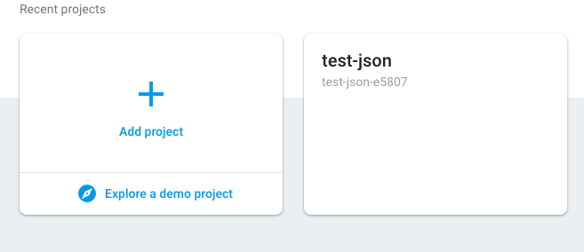
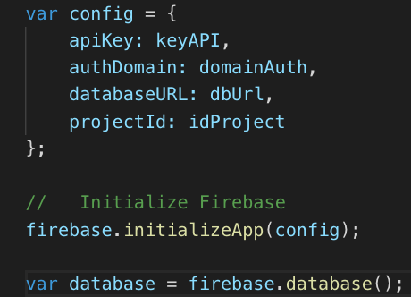
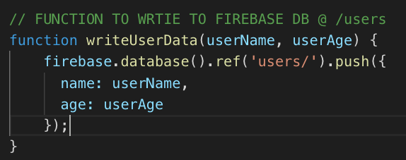
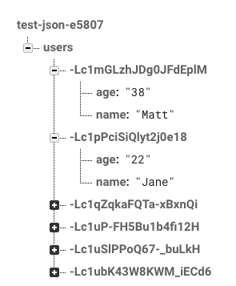
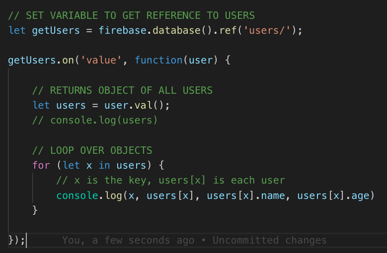

# Firebase Realtime Database Reference

### Add A Project

### Add Code for Config

### Add Code to Write to DB

### Creates Users Table in db with Properties and Values

### Read From Database @ /users

